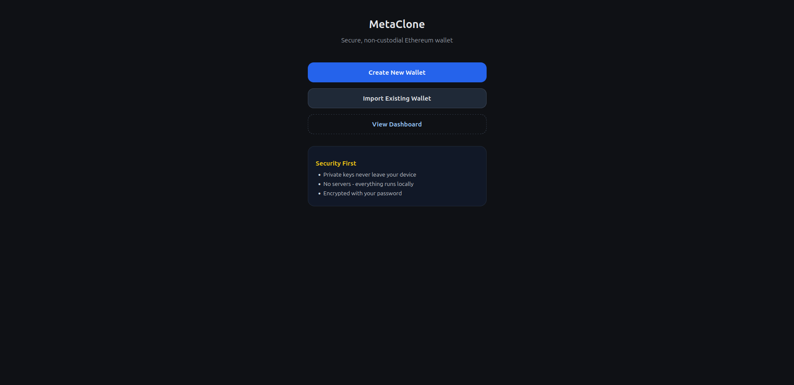
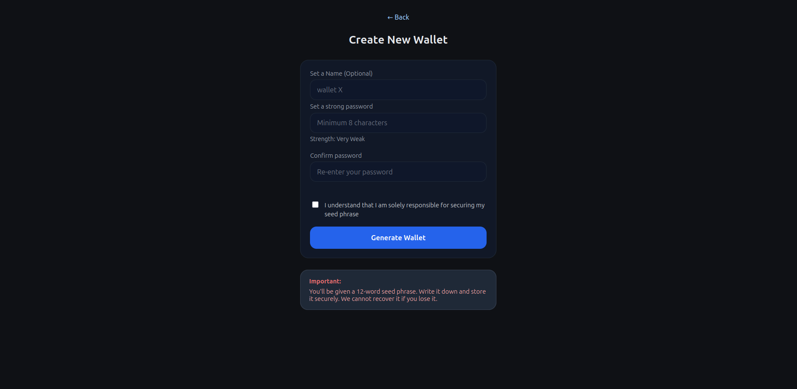
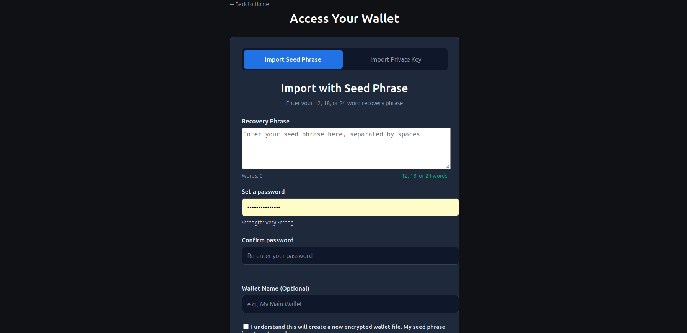
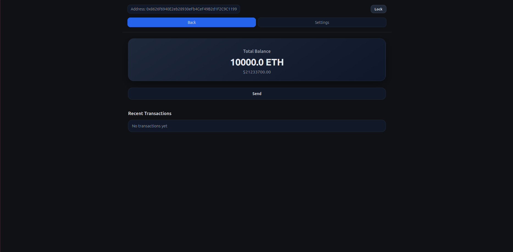
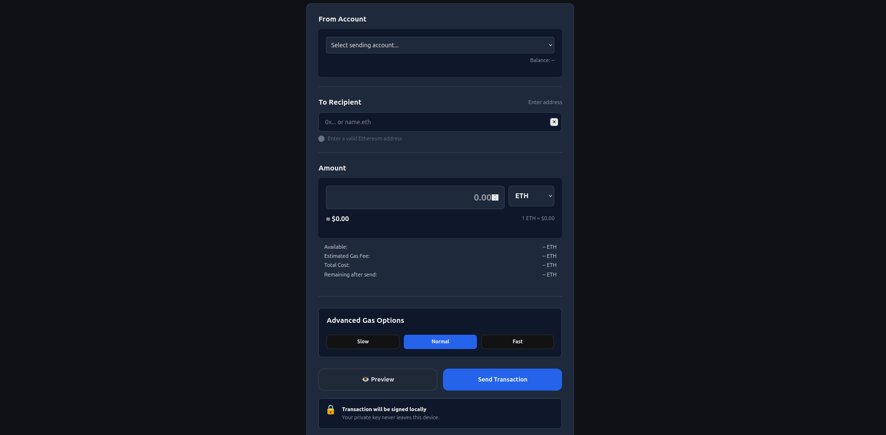
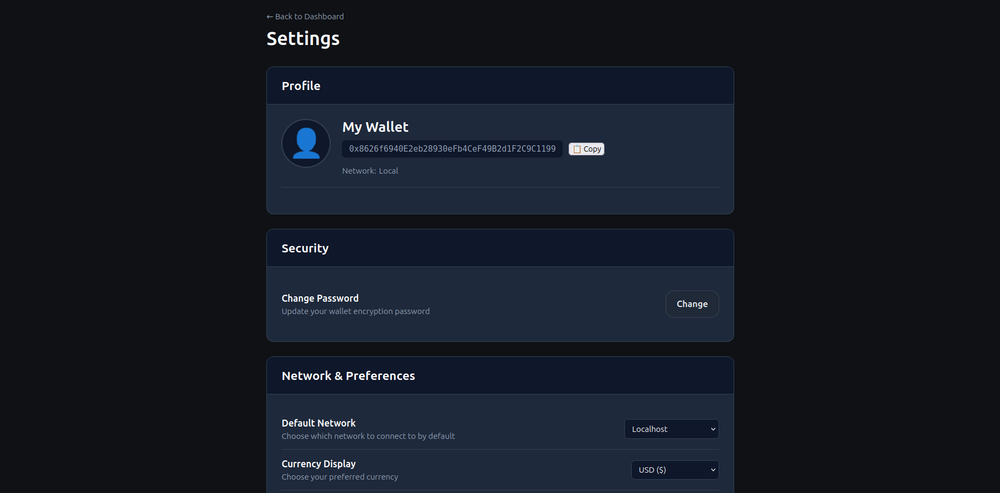

# Metaclone: A Crypto Wallet Web App

This is a simple, client-side webapp I built using **JavaScript**, **Web Workers**, and **IndexedDB** for storage. This project demonstrates the basics of secure key management, blockchain interaction via **ethers.js**, and a nice start for my portfolio.

> This project is for educational and portfolio use only. Do NOT use it to manage real funds, I do not take accountability for possible security issues.

---

## Features

- **Secure Wallet Storage**
  - Private keys encrypted using Web Crypto API.
  -     Namely, PBKDF and AES-GCM with passwords being hashed for storage and authentication purposes.
  - Wallets stored securely in an IndexedDB instance
  - Password-based encryption and verification

- **Blockchain Integration**
  - Connects to Ethereum-compatible networks (localhost, Sepolia, etc.)
  - Sends transactions using `ethers.js`
  - Real-time transaction and balance updates
  - Real-time transaction rates for ETH through API calls to CoinGecko and Binance as a fallback
  - Gas estimation with EIP-1559 support
  - Slow / Normal / Fast fee selection
  - Real-time fee and remaining balance preview

- **Multi-Wallet Support**
  - Create, import, delete, and switch between wallets
  - Password change functionality
  - Persistent wallet state across sessions 

- **Architecture Highlights**
  - Web Workers implemented to separate frontend and business logic and maintain information secure 
  - SPA with dynamic loading of pages implemented through a router class.
  - IndexedDB abstraction layer (`SecureStore`, `StorageUtils`)

---

## Tech Stack

- **Frontend:** Vanilla JavaScript, HTML, CSS
- **Blockchain:** `ethers.js`
- **Storage:** IndexedDB
- **Security:** Web Crypto API (AES-GCM, SHA-256)
- **Concurrency:** Web Workers

---

## Screenshots

  







---

## Getting Started

### 1. Clone the repository
```bash
git clone https://github.com/lapekka11/wallet_project.git
cd wallet_project
```
### 2. Install Dependencies
```bash
npm install
```
### 3. Start the dev server 
```bash
npm run dev
```
### 4. Open in browser 
```bash 
http://localhost:3000 
```
